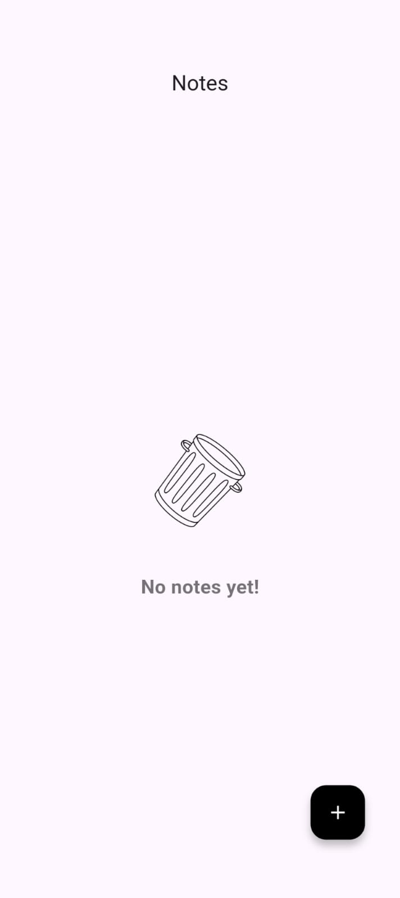

# notes_app

A Flutter application for creating and managing notes and checklists.

## Features

- Add, edit, and delete notes.
- Create checklist-style notes with multiple items.
- Auto-save functionality while typing.
- Mark checklist items as done/undone.
- Sort checklist items automatically: unfinished items appear first.
- Responsive UI with cards and grids.
- Long-press notes to delete with confirmation.
- Floating Action Button to quickly add a note or checklist.

## State Management

This project uses **Riverpod** for state management:

- `noteProvider` is used to manage the list of notes.
- Notes are updated, added, and deleted via the provider.
- Auto-save updates the provider in real-time.

## Getting Started

A few resources to get you started if this is your first Flutter project:

- [Lab: Write your first Flutter app](https://docs.flutter.dev/get-started/codelab)
- [Cookbook: Useful Flutter samples](https://docs.flutter.dev/cookbook)

For help getting started with Flutter development, view the
[online documentation](https://docs.flutter.dev/), which offers tutorials, samples, guidance on mobile development, and a full API reference.

## Installation

1. Clone the repository:

```bash
git clone https://github.com/YourUsername/notes_app.git
Navigate to the project directory:

bash
Copy code
cd notes_app
Install dependencies:

bash
Copy code
flutter pub get
Run the app:

bash
Copy code
flutter run
Dependencies
flutter_riverpod

uuid

hive & hive_flutter

Made with 💜 using Flutter.

## Screenshots

Home Screen:



Note Editor:


